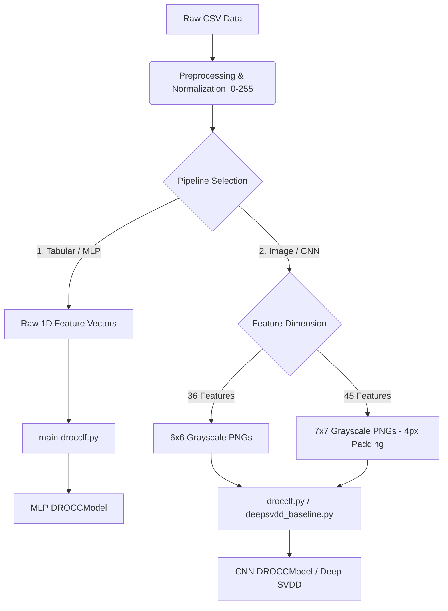

# Anomaly Detection in Network Traffic and Biometric Data using DROCC & Deep SVDD

This repository contains the implementation of anomaly detection (one-class classification) using two different neural architectures:
1.  **Deep Robust One-Class Classification with Limited Far-Negatives (DROCC-LF):** Trains either as a 2D CNN on converted grayscale images or directly as a Multi-Layer Perceptron (MLP) on 1D feature vectors.
2.  **Deep Support Vector Data Description (Deep SVDD):** Used as a comparative baseline model, trained as a 2D CNN on image inputs.

The project is designed for scenarios where anomalous/attack samples are extremely scarce or unavailable during training, learning solely from benign (normal) data.

---

## 📂 Project Directory Structure

```text
drocc/
├── datasets/                             # Raw and Processed Datasets
│   ├── csv/                              # Benign and Attack CSV files
│   ├── ciciomt/                          # CICIOMT dataset folder
│   └── wustlehms.csv                     # Raw WUSTL-EHMS dataset
│
├── preprocessed_data/                    # Preprocessed CSV Files
│   ├── train_normal_scaled.csv           # Normalized normal data for training
│   ├── test_normal_scaled.csv            # Normalized normal data for testing
│   ├── test_attack_scaled.csv            # Normalized attack data for testing
│   └── encoding_summary.txt              # Summary of categorical feature encoding
│
├── utils/                                # Data Preparation Scripts
│   ├── data_preprocessing_label_encode.py # Preprocesses WUSTL-EHMS dataset using Label Encoding
│   ├── data_preprocessing_onehot_encode.py# Preprocesses WUSTL-EHMS dataset using One-Hot Encoding
│   ├── data_preprocessing_cic.py         # Merges and scales CIC network traffic data
│   ├── image_generator.py                # Converts 36-feature CSV rows to 6x6 PNG images
│   └── cicimage_generator.py             # Converts 45-feature CSV rows to 7x7 PNG images (with padding)
│
├── trainer/                              # DROCC Training Modules
│   ├── drocclftrainer.py                 # Core DROCC-LF trainer and optimization solver
│   └── drocclfstrainer.py                # DROCC-LF trainer with close/far negative evaluation
│
├── drocclf.py                            # Image-based (CNN) DROCC-LF training and evaluation script
├── main-drocclf.py                       # Vector-based (MLP) DROCC-LF training and evaluation script
├── deepsvdd_baseline.py                  # Comparative Deep SVDD baseline model
└── venv_cuda/                            # Python Virtual Environment
```

---

## 🛠️ Installation

The project requires PyTorch (CUDA support recommended) and standard data analysis libraries.

### 1. Create and Activate Virtual Environment
```powershell
# Windows PowerShell
python -m venv venv_cuda
.\venv_cuda\Scripts\Activate
```

### 2. Install Dependencies
```bash
pip install torch torchvision numpy pandas matplotlib scikit-learn pillow tqdm
```

---

## 🔄 Two Alternative Pipelines

The repository supports two independent training pipelines depending on the model architecture and data format:



### 1. Tabular Vector Pipeline (MLP Model)
This pipeline feeds the 1D preprocessed features directly into a Multi-Layer Perceptron (MLP) model.
*   **Target Script:** [main-drocclf.py](file:///c:/Users/furka/Desktop/ff/py/drocc/main-drocclf.py)
*   **Model Architecture:** The `DROCCModel` features an input layer matched to the number of columns in the CSV, a hidden layer of size 128 (with batch normalization and LeakyReLU activation), and a linear classification layer.
*   **Data Format:** Raw numerical vectors scaled to `[0, 1]` inside the dataset class.

### 2. Image Conversion Pipeline (2D CNN Models)
This pipeline reshapes the 1D preprocessed features into a 2D square matrix and saves them as grayscale PNGs.
*   **Target Scripts:** [drocclf.py](file:///c:/Users/furka/Desktop/ff/py/drocc/drocclf.py) and [deepsvdd_baseline.py](file:///c:/Users/furka/Desktop/ff/py/drocc/deepsvdd_baseline.py)
*   **Model Architecture:** A 2D Convolutional Neural Network (CNN) containing two convolution blocks, batch normalization, max-pooling, and fully connected representation/classification layers.
*   **Dimensions:**
    *   **6x6 PNGs:** Used for the WUSTL-EHMS dataset after one-hot encoding (36 features mapped to a 6x6 pixel grid).
    *   **7x7 PNGs:** Used for the CIC dataset (45 features padded with 4 zeros to complete a 7x7 grid).

---

## 🔄 Data Preprocessing Instructions

### Step 1: Preprocessing and Scaling CSV Data
Scale features to the 8-bit pixel range (`[0, 255]`) and split datasets:
*   **WUSTL-EHMS (Label Encoding):**
    ```bash
    python utils/data_preprocessing_label_encode.py
    ```
    *Performs feature selection, log scaling for heavy-tailed numerics, and deterministic label encoding for categorical variables.*
*   **WUSTL-EHMS (One-Hot Encoding):**
    ```bash
    python utils/data_preprocessing_onehot_encode.py
    ```
    *Uses One-Hot encoding to produce exactly 36 features, perfect for 6x6 pixels.*
*   **CIC Network Traffic:**
    ```bash
    python utils/data_preprocessing_cic.py
    ```

### Step 2: Vector-to-Image Conversion (Only for CNN Pipeline)
Generate images from the preprocessed CSV splits:
*   **6x6 Images (for WUSTL-EHMS):**
    ```bash
    python utils/image_generator.py
    ```
    *Splits normal samples (80% train, 20% test) and saves output images under the `wustlehms_images_onehot` directory.*
*   **7x7 Images (for CIC):**
    ```bash
    python utils/cicimage_generator.py
    ```
    *Pads the 45-feature vector with four zeros to make it 49, and saves the 7x7 PNGs under the `network_traffic_7x7_images` directory.*

---

## 🚀 Model Training & Evaluation

### 1. Vector-Based DROCC-LF (MLP Model)
To train the MLP model directly on the preprocessed 1D vectors:
```bash
# Train on preprocessed vector CSVs
python main-drocclf.py --epochs 10 --lr 0.001 --model_dir log_drocc_vector

# Evaluate the saved MLP model
python main-drocclf.py --eval 1 --model_dir log_drocc_vector
```

### 2. Image-Based DROCC-LF (CNN Model)
To train a 2D CNN on the generated images:
```bash
# Train on 6x6 wustlehms images
python drocclf.py --epochs 20 --batch_size 128 --lr 0.001 --model_dir log_drocc

# Evaluate the saved CNN model
python drocclf.py --eval 1 --model_dir log_drocc
```

### 3. Image-Based Deep SVDD Baseline (CNN Model)
To train the comparative baseline model:
```bash
# Train on 6x6 wustlehms images
python deepsvdd_baseline.py --img_size 6 --epochs 20 --pretrain_epochs 10 --model_dir svdd_log

# Evaluate the saved Deep SVDD model
python deepsvdd_baseline.py --eval 1 --img_size 6 --model_dir svdd_log
```

---

## 🧠 Algorithmic Details: How DROCC-LF Works

DROCC (Deep Robust One-Class Classification) solves the one-class problem by synthetically generating **adversarial negative points** around the manifold of normal training points, converting the unsupervised task into a robust binary classification task.

1.  **Adversarial Sample Generation (Gradient Ascent):**
    Starting from a normal training sample $x$ perturbed with small random gürültü, the algorithm performs gradient ascent to maximize the classification loss of the point being classified as normal (pushing it towards the decision boundary):
    $$\theta_{adv} \leftarrow \theta_{adv} + \eta \cdot \text{sign}(\nabla_x \mathcal{L}_{CE})$$

2.  **Mahalanobis Projection & Optimization:**
    To ensure the generated adversarial samples are neither too far nor too close to the normal data, they are projected to lie between the spheres of radius $r$ and $\gamma \cdot r$. The `optim_solver` in `trainer/drocclftrainer.py` solves this constrained optimization problem by normalizing gradients and projecting points onto the boundary.

3.  **Loss Function:**
    The network is trained to classify normal points as class $1$ and synthetic adversarial points as class $0$:
    $$\mathcal{L}_{Total} = \mathcal{L}_{CE}(f(x), 1) + \lambda \cdot \mathcal{L}_{CE}(f(x_{adv}), 0)$$

---

## 📊 Evaluation Metrics & Visualization

For unbalanced datasets, accuracy alone is insufficient. The project evaluates models using:

*   **ROC-AUC Score:** Threshold-independent metric summarizing model quality.
*   **Precision & Recall (@FPR 3% and 5%):** Target false alarm rate precision/recall.
*   **Confusion Matrix:** Detailed breakdown of True Positives, False Positives, True Negatives, and False Negatives.
*   **Youden's J Threshold:** Dynamically finds the optimal score cut-off on the ROC curve.

### Diagnostic Visualizations
Plots are automatically saved to `model_dir` after training:
1.  `training_history_plot.png` / `svdd_training_history.png`: Epoch-wise losses (CE Loss, Adv Loss) and validation metrics.
2.  `evaluation_distribution_cm.png`: Grayscale score distribution histograms, target FPR decision boundaries, Youden's J index lines, and confusion matrices.
