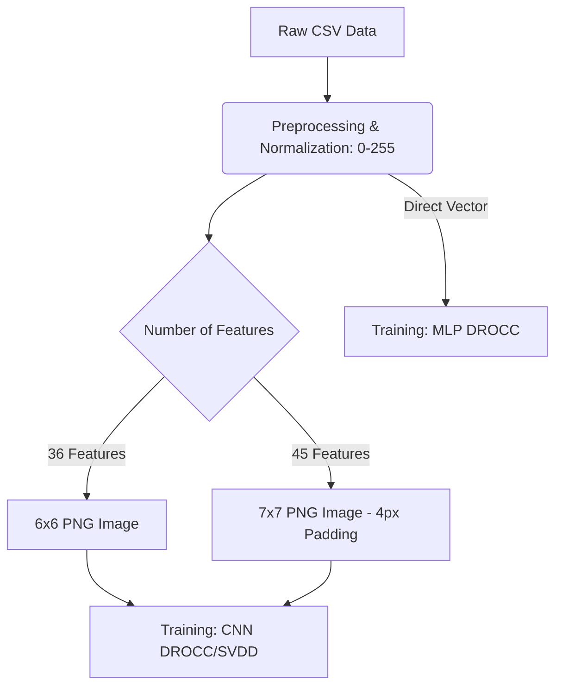

# Anomaly Detection in Network Traffic and Biometric Data using DROCC & Deep SVDD

This project implements anomaly detection (one-class classification) using the **Deep Robust One-Class Classification with Limited Far-Negatives (DROCC-LF)** algorithm and the **Deep Support Vector Data Description (Deep SVDD)** model as a comparative baseline.

The project is designed for scenarios where anomalous/attack samples are extremely scarce or unavailable during training, learning solely from benign (normal) data. Tabular datasets (CSV format) are preprocessed and transformed into 2D grayscale PNG images (6x6 or 7x7 pixels) to be trained on Convolutional Neural Networks (CNNs), or trained directly as vectors using MLP models.

---

## 📂 Project Directory Structure

```text
drocc/
├── datasets/                             # Raw and Processed Datasets
│   ├── csv/                              # Benign and Attack CSV files
│   ├── ciciomt/                          # CICIOMT dataset folder
│   └── wustlehms.csv                     # Raw WUSTL-EHMS dataset
│
├── preprocessed_data/                    # Preprocessed CSV Files
│   ├── train_normal_scaled.csv           # Normalized normal data for training
│   ├── test_normal_scaled.csv            # Normalized normal data for testing
│   ├── test_attack_scaled.csv            # Normalized attack data for testing
│   └── encoding_summary.txt              # Summary of categorical feature encoding
│
├── utils/                                # Data Preparation Scripts
│   ├── data_preprocessing_label_encode.py # Preprocesses WUSTL-EHMS dataset using Label Encoding
│   ├── data_preprocessing_onehot_encode.py# Preprocesses WUSTL-EHMS dataset using One-Hot Encoding
│   ├── data_preprocessing_cic.py         # Merges and scales CIC network traffic data
│   ├── image_generator.py                # Converts 36-feature CSV rows to 6x6 PNG images
│   └── cicimage_generator.py             # Converts 45-feature CSV rows to 7x7 PNG images (with padding)
│
├── trainer/                              # DROCC Training Modules
│   ├── drocclftrainer.py                 # Core DROCC-LF trainer and optimization solver
│   └── drocclfstrainer.py                # DROCC-LF trainer with close/far negative evaluation
│
├── drocclf.py                            # Image-based (CNN) DROCC-LF training and evaluation script
├── main-drocclf.py                       # Vector-based (MLP) DROCC-LF training and evaluation script
├── deepsvdd_baseline.py                  # Comparative Deep SVDD baseline model
└── venv_cuda/                            # Python Virtual Environment
```

---

## 🛠️ Installation

The project requires PyTorch (CUDA support recommended) and standard data analysis libraries.

### 1. Create and Activate Virtual Environment
```powershell
# Windows PowerShell
python -m venv venv_cuda
.\venv_cuda\Scripts\Activate
```

### 2. Install Dependencies
```bash
pip install torch torchvision numpy pandas matplotlib scikit-learn pillow tqdm
```

---

## 🔄 Data Preprocessing & Preparation Workflow

The sequence of steps to prepare raw network/biometric data for training is as follows:



### Step 1: Preprocessing and Scaling CSV Data
Numerical features must be scaled to the 8-bit pixel range (`[0, 255]`) before image conversion:
*   **WUSTL-EHMS (Label Encoding):**
    ```bash
    python utils/data_preprocessing_label_encode.py
    ```
    *Handles feature selection, log transformation (`log10(x+1)`) for heavy-tailed numeric values, and automated categorical encoding, saving the output split to `preprocessed_data/`.*
*   **WUSTL-EHMS (One-Hot Encoding):**
    ```bash
    python utils/data_preprocessing_onehot_encode.py
    ```
    *Converts categorical features to One-Hot columns mapped to `{0, 255}`. Produces exactly 36 features, fitting perfectly into a 6x6 pixel grid.*
*   **CIC Network Traffic:**
    ```bash
    python utils/data_preprocessing_cic.py
    ```

### Step 2: Vector-to-Image Conversion
Preprocessed CSV files are rendered as grayscale images:
*   **6x6 Images (for WUSTL-EHMS):**
    ```bash
    python utils/image_generator.py
    ```
    *Splits normal samples (80% train, 20% test) and assigns all attack samples to test, saving them under the `wustlehms_images_onehot` directory.*
*   **7x7 Images (for CIC):**
    ```bash
    python utils/cicimage_generator.py
    ```
    *Pads the 45-feature vector with four zeros to make it 49, and saves the 7x7 PNGs under the `network_traffic_7x7_images` directory.*

---

## 🚀 Model Training & Evaluation

### 1. CNN-Based DROCC-LF (Image Inputs)
To train a 2D CNN model on the generated images:
```bash
# Train on 6x6 wustlehms images
python drocclf.py --epochs 20 --batch_size 128 --lr 0.001 --model_dir log_drocc

# Evaluate a saved model (eval mode)
python drocclf.py --eval 1 --model_dir log_drocc
```

### 2. Vector-Based DROCC-LF (Tabular/MLP Inputs)
To train a fully-connected MLP directly on the preprocessed 1D vectors:
```bash
python main-drocclf.py --epochs 10 --lr 0.001 --model_dir log_drocc_vector
```

### 3. Baseline Model: Deep SVDD Training
To train the baseline **Deep SVDD** model for comparison:
```bash
# Train baseline on 6x6 images
python deepsvdd_baseline.py --img_size 6 --epochs 20 --pretrain_epochs 10 --model_dir svdd_log

# Evaluate the baseline model
python deepsvdd_baseline.py --eval 1 --img_size 6 --model_dir svdd_log
```

---

## 🧠 Algorithmic Details: How DROCC-LF Works

DROCC (Deep Robust One-Class Classification) solves the one-class problem by synthetically generating **adversarial negative points** around the manifold of normal training points, converting the unsupervised task into a robust binary classification task.

1.  **Adversarial Sample Generation (Gradient Ascent):**
    Starting from a normal training sample $x$ perturbed with small random noise, the algorithm performs gradient ascent to maximize the classification loss of the point being classified as normal (pushing it towards the decision boundary):
    $$\theta_{adv} \leftarrow \theta_{adv} + \eta \cdot \text{sign}(\nabla_x \mathcal{L}_{CE})$$

2.  **Mahalanobis Projection & Optimization:**
    To ensure the generated adversarial samples are neither too far nor too close to the normal data, they are projected to lie between the spheres of radius $r$ and $\gamma \cdot r$. The `optim_solver` in `trainer/drocclftrainer.py` solves this constrained optimization problem by normalizing gradients and projecting points onto the boundary.

3.  **Loss Function:**
    The network is trained to classify normal points as class $1$ and synthetic adversarial points as class $0$:
    $$\mathcal{L}_{Total} = \mathcal{L}_{CE}(f(x), 1) + \lambda \cdot \mathcal{L}_{CE}(f(x_{adv}), 0)$$

---

## 📊 Evaluation Metrics & Visualization

For unbalanced datasets, accuracy alone is insufficient. The project evaluates models using:

*   **ROC-AUC Score:** Threshold-independent metric summarizing model quality.
*   **Precision & Recall (@FPR 3% and 5%):** Target false alarm rate precision/recall.
*   **Confusion Matrix:** Detailed breakdown of True Positives, False Positives, True Negatives, and False Negatives.
*   **Youden's J Threshold:** Dynamically finds the optimal score cut-off on the ROC curve.

### Diagnostic Visualizations
Plots are automatically saved to `model_dir` after training:
1.  `training_history_plot.png` / `svdd_training_history.png`: Epoch-wise losses (CE Loss, Adv Loss) and validation metrics.
2.  `evaluation_distribution_cm.png`: Grayscale score distribution histograms, target FPR decision boundaries, Youden's J index lines, and confusion matrices.
